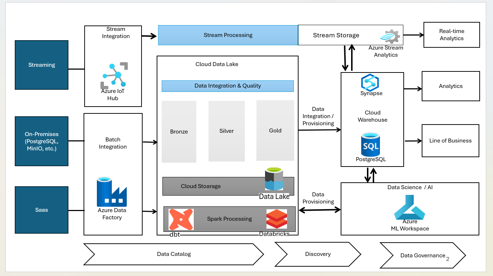
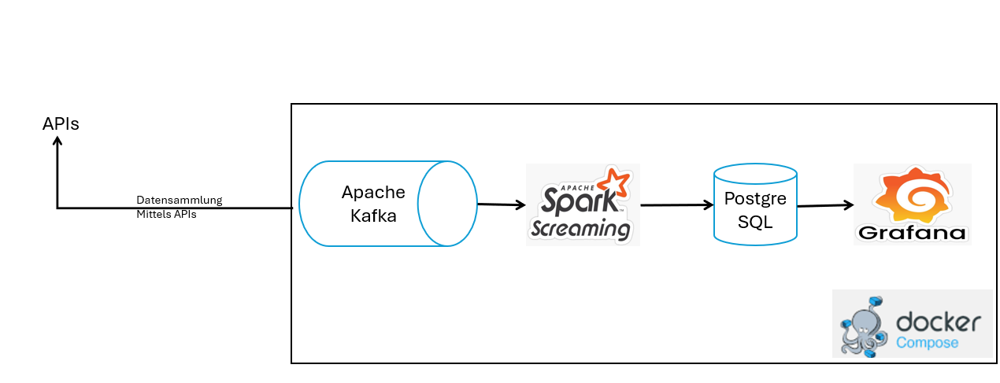

### ▶️ [Data Science & Analytics (in Progress)](./project/README.md)

---

### ▶️ [Projekt 1 – Moderne Datenplattform in Azure](./project-1-data-architecture/README.md)
---

<figcaption>Datenplattform
  

---
### ▶️ [Projekt 2 - Data Engineering (Open Source Plattform)](./project-2-Data-Engineering-OS/README.md)

#### Streaming Data Pipeline
---

<figcaption>Architektur</figcaption>
  

<figcaption>Streaming-Ingestion</figcaption>
  

<figcaption> Data Streaming </figcaption>
  

<figcaption>Datenbank</figcaption>
  

---
### ▶️ [Projekt 3 – Infrastruktur](./project-3-Infrastruktur/README.md)

---
<figure style="text-align: center;">
 <figcaption style="display: block; margin-bottom: 20px;">AWS-Architekturdiagramm mit einer  Cloud-Umgebung</figcaption>
 
</figure>

---

