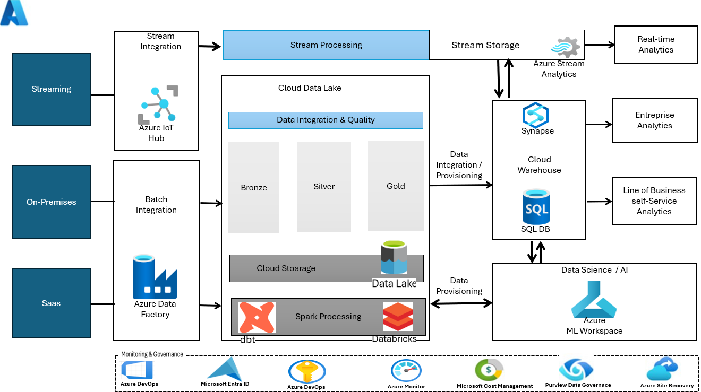
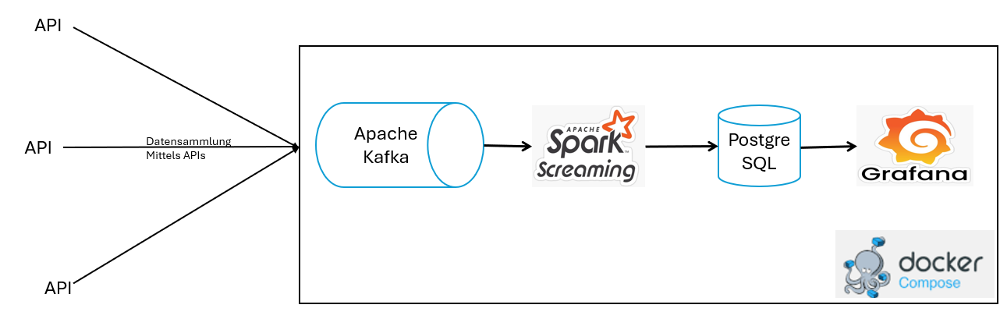
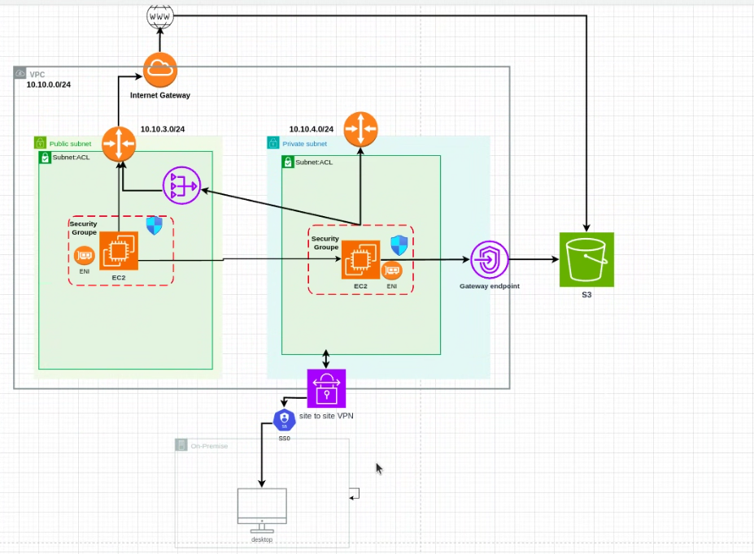

# 💼 Data Engineering Portfolio

<h3 align="center">
  <i>Willkommen zu meinem Portfolio von Data Engineering Projekten mit modernen Datenarchitekturen, Echtzeit-Streaming-Pipelines und Cloud-Infrastruktur-Automatisierung.</i>
</h3>
---

## 🧑‍💻 Über mich

**Data Engineer | Data Scientist | Statistiker** mit umfassender Expertise in der gesamten Data-Value-Chain. Mit einem soliden Fundament in Statistik und fortgeschrittenen Kenntnissen in Data Science entwickle ich skalierbare Datenpipelines, Cloud-native Architekturen und statistische Modelle. Ich spezialisiere mich auf:

**Data Engineer | Data Scientist | Statistiker** mit umfassender Expertise in der gesamten Data-Value-Chain. Mit einem fundierten statistischen Hintergrund und fortgeschrittenen Kenntnissen in Data Science und MLOps entwickle ich skalierbare Datenpipelines, Cloud-native Architekturen und statistische Modelle. 
   
Ich spezialisiere mich auf:
- 📊 **Statistische Analyse** und prädiktive Modellierung
- ⚡ **Echtzeit-Datenverarbeitung** und Streaming-Architekturen  
- 🤖 **Data Science & Machine Learning** Pipeline-Entwicklung
- 🏗️ **Infrastruktur-Automatisierung** für skalierbare Datenlösungen

**🎓 Background:** Statistik-Studium mit Spezialisierung auf Data Science  

### ▶️ [Moderne Datenarchitektur](./projects-Data-Analytics/project-1-Data-architecture/)
**Unternehmensweite Hybrid-Cloud-Datenarchitektur**

**Tech Stack:** Azure Data Factory, Synapse Analytics, Power BI  
**Herausforderung:** Skalierbare Architektur für Multi-Terabyte-Datenverarbeitung entwerfen  

**🎯 Wichtige Erfolge:**
- Architektur für 10TB+ tägliche Datenverarbeitung entworfen
- Echtzeit-Monitoring und Alarmsystem implementiert
- 40% Kostenreduzierung gegenüber On-Premise-Lösung erreicht

*Klicken Sie auf das Bild für weitere Details*
---

### ▶️ [Data Engineering - Open Source Plattform](./projects-Data-Analytics/project-2-Data-Engineering-OS/)
**Containerisierte Datenverarbeitung mit Open Source Tools**

**Tech Stack:** Python, Apache Kafka, PostgreSQL, Docker, Grafana  
**Herausforderung:** Skalierbare Open Source Alternative zu proprietären Lösungen  

**🎯 Wichtige Erfolge:**
- Vollständig containerisierte Architektur
- 100% Open Source Stack
- Kostenreduzierung um 60% gegenüber kommerziellen Lösungen

### ▶️ [Infrastruktur](./projects-Data-Analytics/project-3-Infrastruktur/)
**Infrastructure as Code mit AWS und Terraform**

**Tech Stack:** Terraform, AWS, CI/CD, Infrastructure as Code  
**Herausforderung:** Cloud-Infrastruktur-Deployment automatisieren und standardisieren  

**🎯 Wichtige Erfolge:**
- Wiederverwendbare Terraform-Module für mehrere Umgebungen
- Automatisierte Deployment-Pipeline (dev/staging/prod)
- Infrastruktur-Deployment-Zeit um 75% reduziert

  
  
<em>AWS-Architekturdiagramm mit einer Cloud-Umgebung</em>

---

### ♻️ [ÖKOEFFIZIENT - Prädiktives Emissionsmanagement](./projects-Data-Analytics/project-4-ÖKOEFFIZIENT/)
**KI-gestütztes Emissionsmanagement für Müllverbrennungsanlagen**

**Tech Stack:** Python, Machine Learning, Predictive Analytics, IoT Sensors, Environmental Monitoring  
**Herausforderung:** Umweltauflagen einhalten und gleichzeitig Energieeffizienz maximieren  

**🎯 Wichtige Erfolge:**
- Prädiktive Schadstoffvorhersage mit 95%+ Genauigkeit entwickelt
- Automatisierte Qualitätskontrolle und intelligentes Sortiersystem implementiert
- EU-konforme Berichterstattung vollständig automatisiert
- Energieeffizienz um 25% gesteigert bei 100% Regulatory Compliance

---

### 🔬 [Synthetische Daten für Machine Learning](./projects-Data-Analytics/project-5-synthetic-data/)
**Forschungsprojekt zur Optimierung von ML-Modellen mit künstlichen Datensätzen**

**Tech Stack:** Python, Synthetic Data Generation, Data Quality Framework, ML Model Evaluation  
**Herausforderung:** Datenknappheit in ML-Projekten durch hochqualitative synthetische Daten lösen  

**🎯 Wichtige Erfolge:**
- Umfassendes Data Quality Assessment Framework entwickelt
- Leistungsvergleich: Synthetische vs. reale Daten in ML-Modellen durchgeführt  
- Best-Practice-Leitfaden für synthetische Datennutzung erstellt
- Modellgenauigkeit bei 80% weniger realen Trainingsdaten erreicht

---

### 🚗 [Actuarial Risk Modeling - Kfz-Versicherung](./projects-Data-Analytics/project-7-insurance-modeling/)
**Prädiktive Schadenhöhenmodellierung für faire Versicherungsbeiträge**

**Tech Stack:** Python, Statistical Modeling, Actuarial Science, Feature Engineering, Model Validation, MLOps  
**Herausforderung:** Faire Versicherungsbeiträge basierend auf Kundenrisikomerkmalen berechnen  

**🎯 Wichtige Erfolge:**
- Explorative Datenanalyse von Kfz-Haftpflicht-Versicherungsdaten durchgeführt
- Feature Engineering für Risikomerkmale und Schadeninformationen optimiert
- Vergleichende Modellanalyse mit statistischen Metriken implementiert
- Prädiktives Modell für erwartete Schadenhöhe pro Kunde/Jahr entwickelt
- **Model Deployment Pipeline** für Produktionsumgebung aufgebaut
- **Kontinuierliches Monitoring** für Model Drift und Performance-Überwachung eingerichtet
- Modellinterpretation für Transparenz in Beitragskalkulation sichergestellt

**Methodischer Ansatz:**
- **Explorative Datenanalyse:** Identifikation statistischer Zusammenhänge und Datenqualitätsprobleme
- **Feature Engineering:** Optimierung der Risikomerkmale für Modellierung
- **Modellvergleich:** Systematische Evaluation verschiedener Ansätze mit Validierungsmetriken
- **Model Building:** Training des finalen Modells mit Fokus auf faire Beitragskalkulation
- **Deployment & Monitoring:** Produktive Bereitstellung mit automatisierter Überwachung

**Status:** ✅ Abgeschlossen

---

### 🏠 [HEIZOPTIM - Intelligente Heizungssteuerung](./projects-Data-Analytics/project-6-HEIZOPTIM/)
**MLOps-Pipeline für adaptive Gebäudetemperaturoptimierung**

**Tech Stack:** Python, IoT, Time Series Analysis, MLOps, Predictive Modeling, Statistical Optimization  
**Herausforderung:** Energieverbrauch reduzieren ohne Komfortverlust in Wohngebäuden  

**🎯 Wichtige Erfolge:**
- Selbstlernende Heizkurven-Optimierung mit statistischen Methoden entwickelt
- Intelligente Nachtabsenkung basierend auf Nutzerverhalten implementiert
- Vollständige MLOps-Pipeline für skalierbare Deployment aufgebaut
- Energieeinsparung von 30%+ durch prädiktive Steuerungsalgorithmen erreicht

**Status:** 🚧 In Entwicklung (Phase 2: KI-Integration)

---