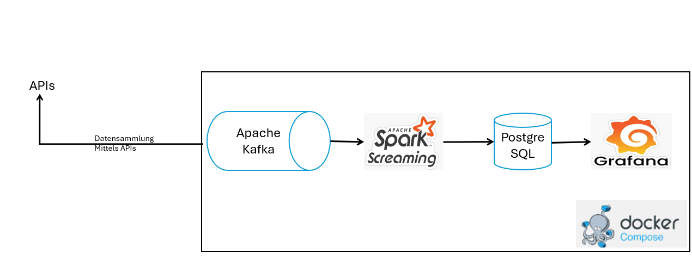
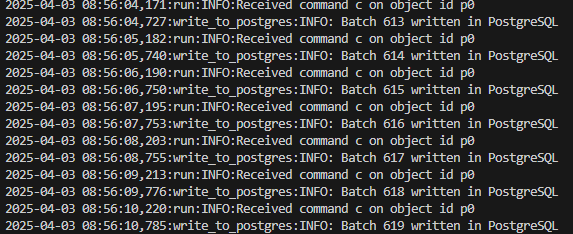

### ▶️ [Projekt 1 – Moderne Datenplattform in Azure](./project-1-data-architecture/README.md)

---

#### Datenplattform

  

---
### ▶️ [Projekt 2 - Data Engineering (Open Source Plattform)](./project-2-Data-Engineering-OS/README.md)

#### Streaming Data Pipeline
---

<figcaption>Architekturdiagram</figcaption>
  

<figcaption>Streaming-Ingestion</figcaption>
  

<figcaption> Data Streaming </figcaption>
  

<figcaption>Inhalt der Datenbank</figcaption>
  

---
### ▶️ [Projekt 3 – IIoT -  Management](./project-4-IIoT-management/README.md)

#### Überwachung der Emissionen im Zeitverlauf 

  

---

  <figcaption>Luftemissionen im Blick – ein Beitrag für die Umwelty</figcaption>
  
  <figcaption>
    <a href="https://powerzone.clarkpublicutilities.com/learn-about-renewable-energy/biomass-energy/" target="_blank">
      Source: Clark Public Utilities Biomass Energy
    </a>
  </figcaption>

