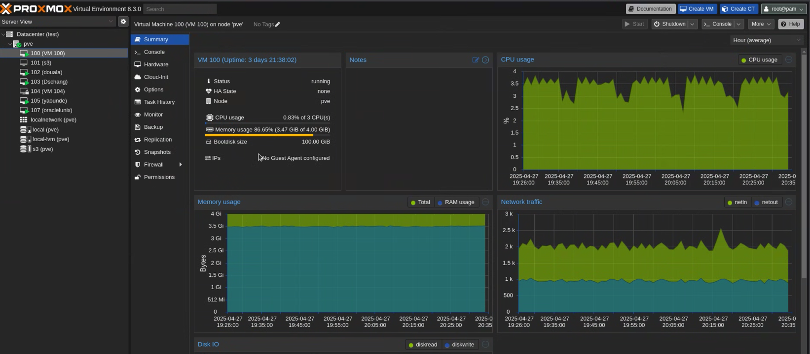

## Proxmox - Host für die Anwendungen

Proxmox wird als Plattform für die Virtualisierung verwendet, Um verschiedene Anwendungen und Datenpipelines zu hosten. Es stellt eine zuverlässige und skalierbare Infrastruktur für die Verwaltung von virtuellen Maschinen und Containern bereit. Alle Anwendungen und Datenverarbeitungsprozesse werden auf Proxmox gehostet, was eine hohe Verfügbarkeit und einfache Verwaltung derr Ressourcen ermöglicht. Proxmox ist auf meinem Mini-PC installiert, was eine kompakte Lösung für die Virtualisierung und das Hosting meiner Anwendungen bietet.

    

---

### ▶️ [Projekt 1 – Moderne Datenplattform in Azure](./project-1-data-architecture/README.md)
---

<figcaption>Datenplattform
  

---
### ▶️ [Projekt 2 - Data Engineering (Open Source Plattform)](./project-2-Data-Engineering-OS/README.md)

#### Streaming Data Pipeline
---

<figcaption>Architektur</figcaption>
  

<figcaption>Streaming-Ingestion</figcaption>
  

<figcaption> Data Streaming </figcaption>
  

<figcaption>Datenbank</figcaption>
  

---
### ▶️ [Projekt 3 – Infrastruktur](./project-3-Infrastruktur/README.md)

---
<figure style="text-align: center;">
 <figcaption style="display: block; margin-bottom: 20px;">AWS-Architekturdiagramm mit einer  Cloud-Umgebung</figcaption>
 
</figure>

---

