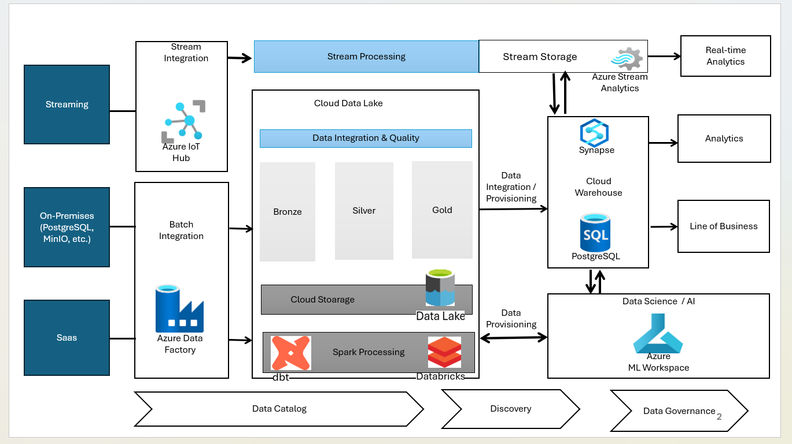

▶️ [Projekt 1 – Moderne Datenplattform in Azure](./project-1-data-architecture/README.md)

---

##  Architekturdiagramm

  

---
### ▶️ [Projekt 2 – Data Engineering (Open Source Plattform)](./project-2-Data-Engineering-OS/README.md)

---

## Architekturdiagramm

  

  

  

  

