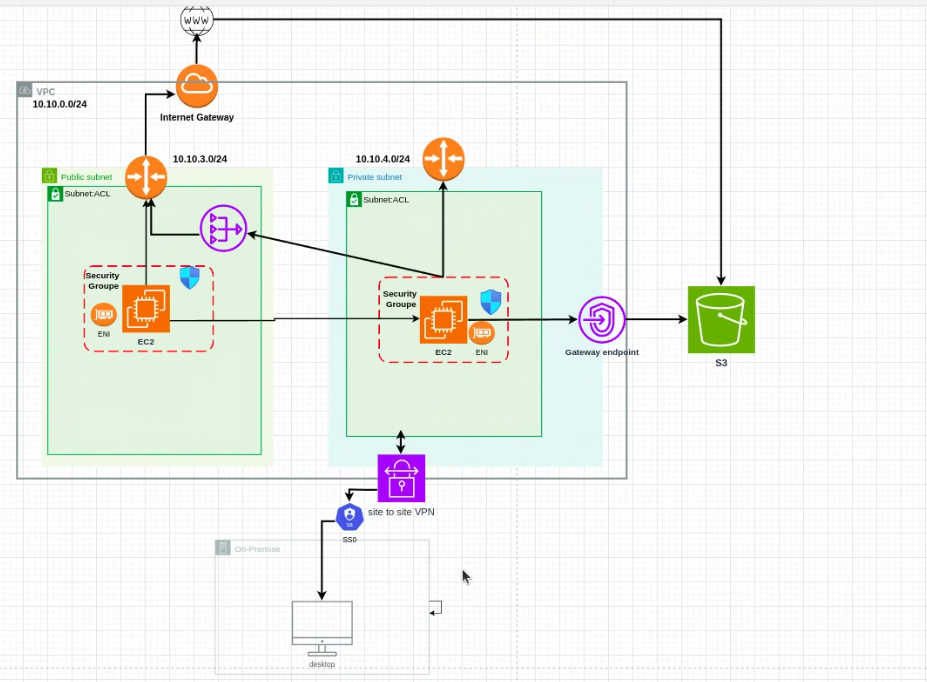

### AWS Cloud-Hybridarchitektur

Diese Architektur folgt den Designprinzipien des AWS Well-Architected Frameworks und bietet Sicherheit, hohe Verfügbarkeit und Skalierbarkeit.

---
<figure style="text-align: center;">
  <figcaption style="display: block; margin-bottom: 20px;">AWS-Architekturdiagramm mit einer hybriden Cloud-Umgebung</figcaption>
  
</figure>
---

## Beschreibung
Diese Architektur stellt unsere AWS-Cloud-Infrastruktur mit Hybrid-Konnektivität dar. Sie ermöglicht die sichere Bereitstellung unserer Anwendungen und behält gleichzeitig eine Verbindung zu unserer On-Premises-Infrastruktur.

## Schlüsselkomponenten
- VPC 
- Öffentliche und private Subnetze
- EC2-Instanzen, geschützt durch Sicherheitsgruppen
- S3-Speicher, zugänglich über Gateway-Endpunkt
- Site-to-Site VPN-Verbindung zu unserer On-Premises-Infrastruktur
- SSO-Authentifizierung

## Datenfluss
1. Externer Datenverkehr gelangt durch das Internet-Gateway herein
2. Anwendungen im öffentlichen Subnetz können auf das Internet zugreifen
3. Anwendungen im privaten Subnetz greifen über den Gateway-Endpunkt auf S3-Ressourcen zu
4. Die VPN-Verbindung ermöglicht On-Premises-Benutzern den sicheren Zugriff auf Cloud-Ressourcen

## Sicherheitsüberlegungen
- Trennung von öffentlichen und privaten Zonen
- Verwendung von Sicherheitsgruppen zur Verkehrskontrolle
- ACLs zur Verstärkung der Netzwerksicherheit

