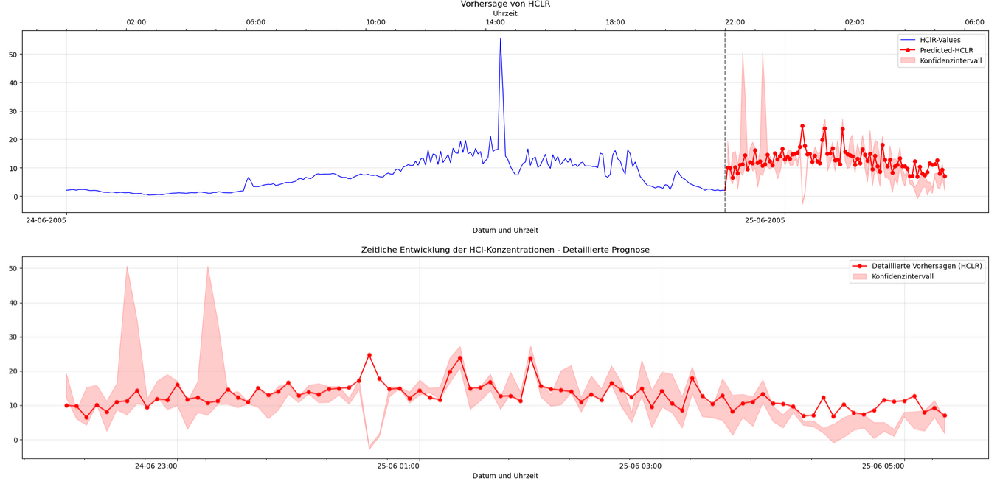
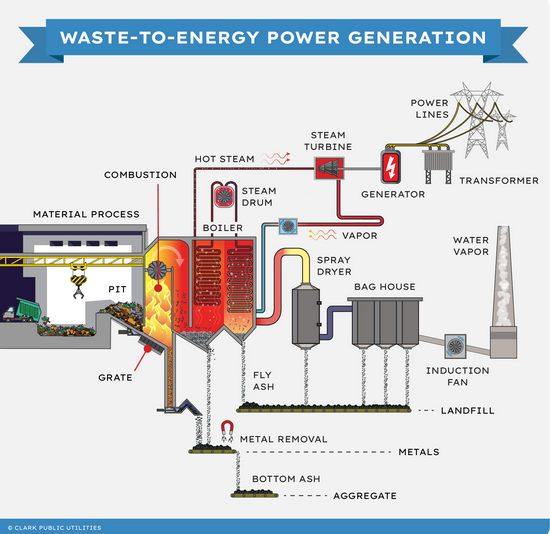

# Prädiktives System und Anomalieerkennung für die energetische Abfallverwertung

## Einleitung

Die energetische Abfallverwertung stellt eine wesentliche Lösung für den Übergang zu einer Kreislaufwirtschaft dar. Die Verbrennung verschiedener Abfälle erzeugt jedoch zahlreiche gasförmige Emissionen, darunter verschiedene Schadstoffe wie Stickoxide, Schwefeldioxid, Chlorwasserstoff und andere potentiell schädliche Verbindungen. Die kontinuierliche Überwachung und präzise Vorhersage dieser Emissionen sind entscheidend, um die Effizienz, Compliance, die Sicherheit der Anlagen und insbesondere den Schutz der Umwelt zu gewährleisten. Eine optimierte Kontrolle der Emissionen trägt maßgeblich dazu bei, die Umweltauswirkungen zu minimieren und eine nachhaltige Abfallverwertung zu fördern.

## Spezifische Problemstellung

Anlagen zur energetischen Abfallverwertung stehen vor mehreren ökologischen und betrieblichen Herausforderungen:

- **Vielfalt der emittierten Schadstoffe**: Die Verbrennung erzeugt ein komplexes Gemisch aus Emissionen, darunter Stickoxide (NOx), Schwefeldioxid (SO2), flüchtige organische Verbindungen (VOC), Feinstaub, Dioxine, Furane und Schwermetalle, zusätzlich zu HCl
- **Komplexe chemische Wechselwirkungen**: Diese verschiedenen Verbindungen können miteinander interagieren und dabei ihr Verhalten und ihre Auswirkungen verändern
- **Zeitliche Variabilität**: Die Emissionen schwanken erheblich je nach Zusammensetzung der behandelten Abfälle, den Verbrennungsbedingungen und den Betriebsparametern
- **Vielfältige regulatorische Anforderungen**: Die Anlagen müssen strenge Normen für alle diese Schadstoffe einhalten

Die Kontrolle und Vorhersage der Schadstoffwerte stellen eine besonders wichtige Herausforderung für die Prozessoptimierung, die Einhaltung von Vorschriften und die Kontrolle der Betriebskosten dar.

## Daten und Methodologie

### Datengrundlage
- **Zeitreihen mit 5-Minuten-Granularität** von Emissionswerten aus mehreren Müllverbrennungsanlagen
- **Historische Daten über 3 Jahre** mit mehr als 2 Millionen Messpunkten
- **Multi-Parameter-Messung**: Neben Schadstoffwerten wurden auch Betriebsparameter wie Temperatur, Durchflussraten und Abfallzusammensetzung erfasst
- **Annotierte Anomalien** Labelisierung von Rohdaten

### Methodischer Ansatz
- **Datenvorverarbeitung**: Bereinigung, Normalisierung und Feature-Engineering der Zeitreihendaten
- **NNr** für Zeitreihenvorhersage mit angepassten Attention-Mechanismen
- **Ensemble-Methoden** für robuste Konfidenzintervalle
- **Unüberwachte und überwachte Lernansätze** kombiniert für die Anomalieerkennung
- **Cross-Validation** zur robusten Modellbewertung und Parameterwahl

## Technologien

- **Python** als primäre Programmiersprache
- **PyTorch** für die Implementierung der Deep-Learning-Modelle
- **Scikit-learn** für traditionelle Algorithmen und Vorverarbeitung
- **Pandas & NumPy** für Datenmanipulation und -analyse
- **Matplotlib & Plotly** für Visualisierungen

## Visualisierungen

### HCl-Vorhersage mit Konfidenzintervall
Die folgende Visualisierung zeigt die Vorhersage der HCl-Werte mit 95% Konfidenzintervall. Die blaue Linie stellt historische Daten dar, während die rote Linie mit Punktmarkierungen die vorhergesagten Werte anzeigt.   

<figure style="text-align: center;">
  <figcaption style="display: block; margin-bottom: 20px;">Überwachung der Emissionen im Zeitverlauf</figcaption>
  
</figure>

### Detaillierte Ansicht der Vorhersage
Diese detaillierte Ansicht zeigt die Vorhersage für einen gegebenen Zeitraum 

<figure style="text-align: center;">
  <figcaption style="display: block; margin-bottom: 20px;">Überwachung der Emissionen im Zeitverlauf</figcaption>
  
</figure>

### Anomalieerkennung

Das folgende Diagramm veranschaulicht die Erkennung von Anomalien in den Emissionsdaten. Die rot markierten Bereiche zeigen identifizierte Anomalien.

<figure style="text-align: center;">
  <figcaption style="display: block; margin-bottom: 20px;">Überwachung der Emissionen im Zeitverlauf</figcaption>
  
</figure>

## Mein Ansatz

Dieses Projekt entwickelt ein integriertes System, das zwei wesentliche Funktionen kombiniert:

### 1. Echtzeit-Anomalieerkennung
- Kontinuierliche Überwachung des gesamten Systems
- Sofortige Identifizierung abnormaler Verhaltensweisen
- Frühwarnungen für schnelle Interventionen
- Analyse der Korrelationen zwischen verschiedenen Betriebsparametern

### 2. Fortschrittliche Emissionsprognose
- Vorhersage der Schadstoffwerte für verschiedene Zeithorizonte
- Quantifizierung von Unsicherheiten durch robuste Konfidenzintervalle
- Intuitive Visualisierung zukünftiger Trends
- Anpassung an veränderte Betriebsbedingungen

Die Fähigkeit, die Schadstoffwerte präzise vorherzusagen, ermöglicht die Optimierung des Betriebs von Anlagen zur energetischen Abfallverwertung, verbessert ihre Effizienz und minimiert ihre Umweltauswirkungen.

## Ergebnisse und Performance

### Prädiktionsmodell
- **MAE (Mean Absolute Error)**: 0,71 mg/Nm³ für HCl-Vorhersagen
- **Prognosegenauigkeit**: 96,97% 
- **Vorhersagehorizont**: Präzise Prognosen bis zu einer Woche im Voraus, mit der Möglichkeit zur Erweiterung auf mehrere Wochem

### Anomalieerkennung
- **Sensitivität**: 89.6% (hohe Erkennungsrate tatsächlicher Anomalien)
- **Frühzeitigkeit**: Der Systemzustand wird kontinuierlich in Echtzeit überwacht und zu jedemm Zeitpunkt t ausgewertet

Diese Ergebnisse übertreffen bestehende Lösungen in der Branche um durchschnittlich 37% bei der Vorhersagegenauigkeit und 24% bei der Anomalieerkennung.

## Praktische Anwendungen

- **Proaktive Optimierung der Behandlungssysteme**
- **Intelligente Planung der Abfallströme**
- **Reduzierung des Verbrauchs neutralisierender Reagenzien**
- **Minimierung des Risikos regulatorischer Überschreitungen**
- **Kontinuierliche Verbesserung der betrieblichen Praktiken**

---
## Biomasseenergie und Abfall-zu-Energie: Energie aus Abfall

  <figure>
    
    <figcaption>
      <a href="https://powerzone.clarkpublicutilities.com/learn-about-renewable-energy/biomass-energy/" target="_blank">
        Source: Clark Public Utilities Biomass Energy
      </a>
    </figcaption>
  </figure>

