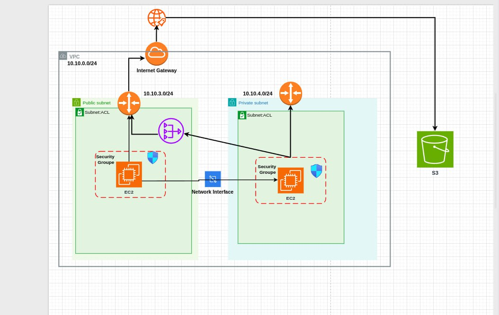

### AWS VPC Multi-Zonen-Architektur

Architekturdiagramm, das ein AWS VPC (10.10.0.0/24) mit öffentlichen und privaten Subnetzen darstellt, konfiguriert nach Sicherheits-Best-Practices.

#### Schlüsselkomponenten
- VPC mit öffentlichem (10.10.3.0/24) und privatem (10.10.4.0/24) Subnetz
- Dedizierte Routing-Tabellen für jedes Subnetz
- EC2-Instanzen, geschützt durch Sicherheitsgruppen
- S3-Zugriff aus dem VPC
- Internet-Gateway für externe Konnektivität

Diese Architektur folgt den Designprinzipien des AWS Well-Architected Frameworks und bietet Sicherheit, hohe Verfügbarkeit und Skalierbarkeit.

<figure style="text-align: center;">
  <figcaption style="display: block; margin-bottom: 20px;">aws-architektur</figcaption>
  
</figure>
---

##### S3-Optimierung über VPC-Endpunkt (in progress)

Um die Infrastrukturkosten zu senken und die Leistung zu verbessern, wurde die Architektur durch Hinzufügen eines Gateway-VPC-Endpunkts für S3 optimiert. Diese Konfiguration ermöglicht:

- Eine direkte Verbindung zwischen dem privaten Subnetz und S3 ohne Umweg über das NAT-Gateway
- Reduzierte Latenz für S3-Operationen
- Erhöhte Sicherheit, da der Datenverkehr innerhalb des AWS-Netzwerks bleibts