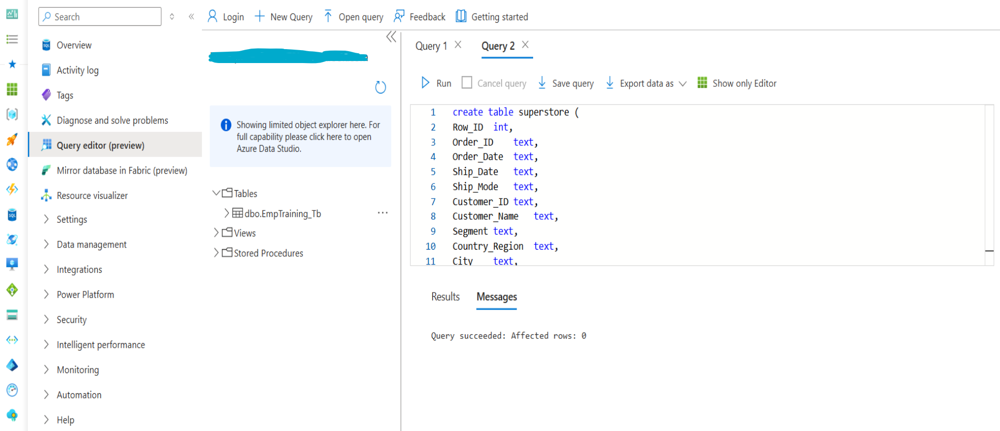

# Migration von On-Premises-Systemen zu Azure SQL Database

Basierend auf einer sorgfältigen Analyse der Bandbreite sowie einem umfassenden Audit der zu migrierenden Daten wurden die folgenden Migrationsansätze ausgewählt und umgesetzt.

## On-Premise zu Azure SQL DB Migration über  Azure Data Factory

### Zielsetzung
Migration von Daten aus On-Premise-MySQL-Datenbank in eine Azure SQL-Datenbank mithilfe von Azure Data Factory (ADF).

Schritt 1: Eingabedataset erstellen
- Navigation in ADF zum Bereich „Datasets
- Erstellung eines neuen Datasets mit Auswahl von MySQL
- Verwendung des entsprechenden Linked Service, der mit der lokalen MySQL-Datenbank verbunden ist (z. B. mysql2adf_LS)
- Sicherstellung der Verwendung einer Self-hosted Integration Runtime als Integration Runtime (z. B. SelfHostedIntegrationRT)
- Manuelle Eingabe des Tabellennamens, z. B. marketing

Schritt 2: Ausgabedataset erstellen
- Erstellung eines neuen Datasets für Azure SQL-Datenbank
- Auswahl des Linked Service für Azure SQL (z. B. adf2asql_LS)
- Manuelle Angabe von Schema und Tabellenname, z. B. marketingq_Tb

Schritt 3: Erstellen einer Pipeline mit Copy Activity

  

- Erstellung einer neuen Pipeline (z. B. OnPrem2ASQL_AZPLAT)
- Hinzufügen einer Copy Data-Aktivität
- Festlegung der Quelle: Verwendung des Datasets InputData (MySQL)
- Festlegung des Ziels: Verwendung des Datasets OutputData (Azure SQL)
- Validierung und Veröffentlichung der Pipeline

Step 4: Trigger & Monitor Pipeline Run
- Überwachung des Fortschritts der Pipelineausführung im Bereich „Pipeline Runs“ der ADF-Oberfläche nach der Auslösung der Pipeline
- Einsicht in den Aktivitätsstatus, die Ausführungsdauer sowie die Details zur Integration Runtime

Schritt 5: Überprüfung der Daten in ASQL

---

  

---
- Zugang zur Azure SQL-Datenbank über die entsprechende Benutzeroberfläche oder SQL-Client-Tools.
- Überprüfung der übertragenen Daten in der angegebenen Tabelle, z. B. marketing_Tab.
- Validierung der Datenkonsistenz und Integrität zwischen der ursprünglichen MySQL-Datenbank und der Azure SQL-Datenbank.

---
- Verwendung von Azure Data Factory zur Verbindung von On-Premise-MySQL und Azure SQL
- Erstellung von Datasets und Linked Services
- Aufbau und Auslösung einer Copy Data-Pipeline
- Überwachung der Ausführung und Verifizierung der erfolgreichen Datenmigration
---

## On-Prem → Azure SQL Migration mit Incremental Load (ADF)

---

  

---

Zielsetzung
- Migration von On-Premises-MySQL-Daten in eine Azure SQL-Datenbank
- Verwendung von inkrementellem Laden (Delta Loads)
- Automatisierung mit Azure Data Factory (ADF)
- Filtern nur neuer oder aktualisierter Daten anhand der Spalte LastUpdate

Zieltabelle (Azure SQL)
- Manuelle Erstellung der Tabelle in Azure SQL
- Übereinstimmung des Schemas mit der MySQL-Quelldatenbank

---

  

---

Lookup-Aktivität in ADF-Pipeline
- Verwendung der Lookup-Aktivität, um den neuesten LastUpdate-Wert aus der Zieltabelle abzurufen
- Verwendete Abfrage :
  - SELECT MAX(LastUpdate) AS LUD FROM superstore;
  - Dieser Wert wird gespeichert und im nächsten Schritt dynamisch verwendet

Copy Activity mit  Incremental Query
- Incremental Load Query Logic
  - Dynamischer Inhalt: @{...}-Ausdruck
  - Basiert auf dem Lookup des MAX(LastUpdate)-Werts aus Azure SQL

- Ausführung und Überwachung der Pipeline
  - Pipeline-Name: IncrementalLoad_PL
  - Aktivitäten: Lookup und Kopieren von Daten mit dynamischer Abfrage als Quelle und Azure SQL als Ziel
  - Ausführen der ADF-Pipeline
  - Überwachen des Pipeline-Laufs auf erfolgreichen Abschluss und Analyse der Datenbewegung
  - Überprüfung in Azure SQL, ob Datensätze korrekt eingefügt wurden

- Validate Incremental Load

---

  

---
- Mit Abfragen in Azure SQL überprüfen, dass nur neue Datensätze eingefügt wurden
- Bestätigen, dass die Filterung über LastUpdate wie erwartet funktioniert