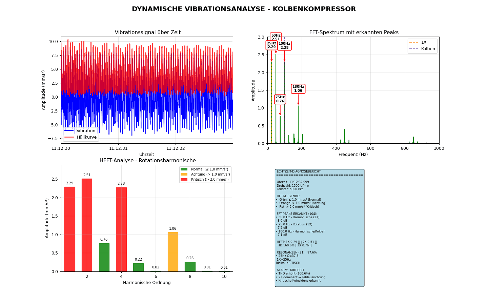

## 🧠 Signalverarbeitung für Industriekompressoren

Dieses Projekt befasst sich mit der Schwingungsanalyse und Resonanzdetektion bei Industriekompressoren.  
Zum Einsatz kommen:

- Erweiterte Spektralanalyse
- HFFT-basierte Harmonischenextraktion
- Automatisierte Fehlerdiagnose

Ziel ist die präzise Erkennung von Anomalien und Resonanzphänomenen auf Basis von Vibrationsdaten in industriellen Anlagen.

---

  

---