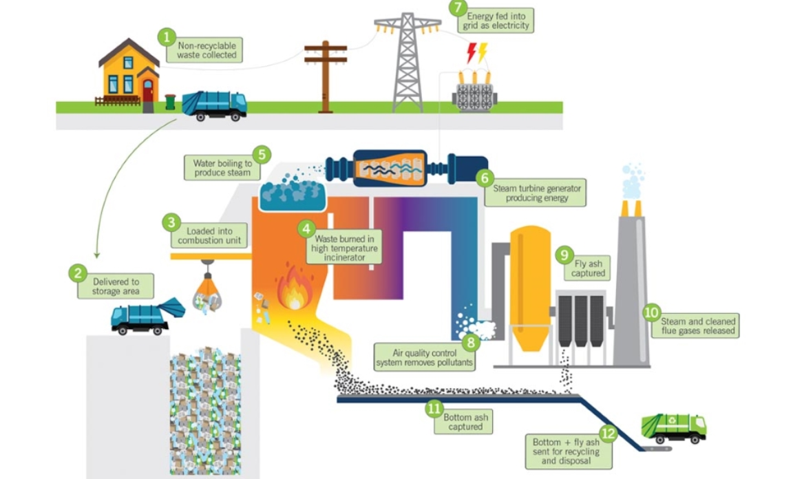

# Luftemissionen im Blick – unser Beitrag für die Umwelt

## 1. Ausgangslage und Ziel des Projekts

### Ausgangslage

Bei der Verbrennung von Abfällen entstehen verschiedene Schadstoffe in der Luft, wie zum Beispiel Kohlenmonoxid (CO), Stickoxide (NOₓ), Schwefeldioxid (SO₂), Salzsäure (HCl) und Ammoniak (NH₃).  
Damit diese Schadstoffe nicht in zu großer Menge in die Umwelt gelangen, gibt es strenge gesetzliche Vorgaben. Deshalb müssen die Emissionen laufend gemessen und kontrolliert werden.

### Ziel des Projekts

Das Ziel dieses Projekts ist es, ein modernes System zu entwickeln, das:

1. die entstehenden Emissionen automatisch überwacht, und  
2. frühzeitig vorhersagen kann, wenn bestimmte Grenzwerte möglicherweise überschritten werden.

Ein solches System trägt nicht nur zur Einhaltung gesetzlicher Vorgaben bei, sondern unterstützt auch die Optimierung des thermischen Verwertungsprozesses selbst – im Sinne eines nachhaltigeren Umgangs mit Ressourcen und einer besseren Luftqualität.

---

  <figure>
    
    <figcaption>
      <a href="https://powerzone.clarkpublicutilities.com/learn-about-renewable-energy/biomass-energy/" target="_blank">
        Source: Clark Public Utilities Biomass Energy
      </a>
    </figcaption>
  </figure>

---

### Fazit

Mit der Entwicklung eines intelligenten Monitoringsystems leistet dieses Projekt einen wichtigen Beitrag zum Umweltschutz. Durch die kontinuierliche Überwachung und die Vorhersage kritischer Emissionen wird es möglich, frühzeitig einzugreifen und die Auswirkungen auf Mensch und Natur zu minimieren.  
Das Projekt ist damit ein weiterer Schritt in Richtung einer nachhaltigeren und verantwortungsbewussteren Abfallwirtschaft.
