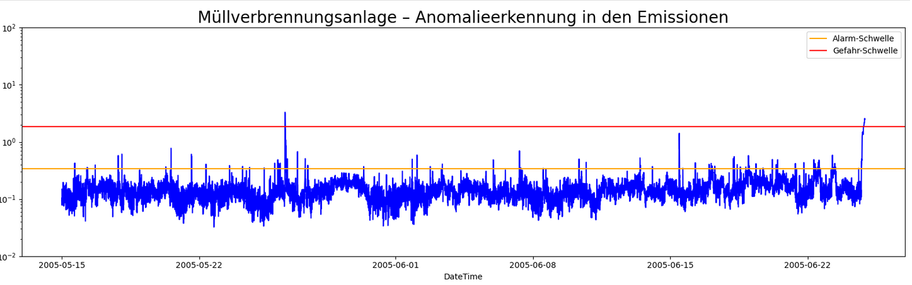

# Luftemissionen im Blick – ein Beitrag für die Umwelt

## 1. Ausgangslage und Ziel des Projekts

### 1.1 Ausgangslage

Bei der Verbrennung von Abfällen entstehen verschiedene Schadstoffe in der Luft, wie zum Beispiel Kohlenmonoxid (CO), Stickoxide (NOₓ), Schwefeldioxid (SO₂), Salzsäure (HCl), ...
Damit diese Schadstoffe nicht in zu großer Menge in die Umwelt gelangen, gibt es strenge gesetzliche Vorgaben. Deshalb müssen die Emissionen laufend gemessen und kontrolliert werden.

### 1.2 Ziel des Projekts

Das Ziel dieses Projekts ist es, ein modernes System zu entwickeln, das:

1. die entstehenden Emissionen automatisch überwacht, und  
2. frühzeitig vorhersagen kann, wenn bestimmte Grenzwerte möglicherweise überschritten werden.
   → Recursive Forecasting
   → Multistep Forecasting

------   
<figure style="text-align: center;">
  <figcaption style="display: block; margin-bottom: 20px;">Überwachung der Emissionen im Zeitverlauf</figcaption>
  
</figure>

---

  <figure>
    
    <figcaption>
      <a href="https://powerzone.clarkpublicutilities.com/learn-about-renewable-energy/biomass-energy/" target="_blank">
        Source: Clark Public Utilities Biomass Energy
      </a>
    </figcaption>
  </figure>

---

